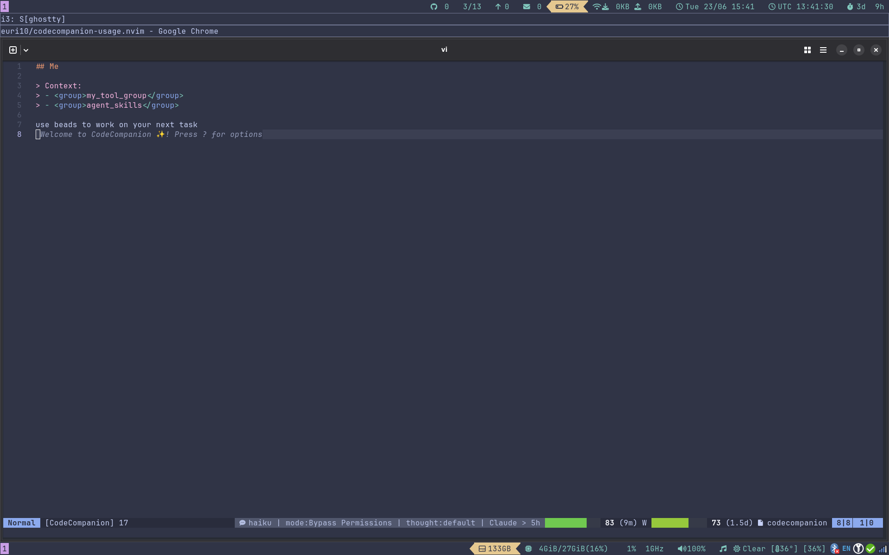

# CodeCompanion Usage

A Neovim extension for [codecompanion.nvim](https://github.com/olimorris/codecompanion.nvim) that displays AI usage and rate-limit information in your statusline.

Shows usage statistics for:
- **Codex** (OpenAI Codex CLI) – reads auth from `~/.codex/auth.json` and queries the Codex usage API
- **Claude Code** (Anthropic Claude Code) – reads OAuth credentials from `~/.claude/.credentials.json` and queries the Anthropic OAuth usage API.
- **DeepSeek** (DeepSeek API) – reads API key from `~/.deepseek/api_key` or `DEEPSEEK_API_KEY` env var and queries the DeepSeek balance API.

Built following the architecture of [CodexBar](https://github.com/steipete/CodexBar).

## Installation

Using **lazy.nvim**:

```lua
{
  "olimorris/codecompanion.nvim",
  dependencies = {
    -- … other dependencies
    {
      "your-username/codecompanion-usage.nvim",
      config = function()
        require("codecompanion._extensions.usage").setup({
          providers = {
            codex = { enabled = true },
            claude_code = { enabled = true },
            deepseek_acp = { enabled = true },
          },
        })
      end,
    },
  },
}
```

## How It Works

### Codex Provider
Reads the Codex access token from `~/.codex/auth.json` (or `$CODEX_HOME/auth.json`) and calls the Codex usage API at `https://chatgpt.com/backend-api/wham/usage`. No token refresh is performed; if the token is expired, run `codex login` to refresh.

### Claude Provider
Reads the OAuth access token from `~/.claude/.credentials.json` and calls `https://api.anthropic.com/api/oauth/usage`. If the token is expired, it attempts a refresh via `https://platform.claude.com/v1/oauth/token` using the stored refresh token. Updated tokens are written back to the credentials file.

> **Note:** The Claude OAuth token in `.credentials.json` may become stale because the Claude CLI does not always write refreshed tokens back to this file. If you see an authentication error, run `claude login` (or simply use `claude` interactively) to refresh your session, then try again.

### DeepSeek Provider
Reads the API key from `$DEEPSEEK_API_KEY` environment variable or `~/.deepseek/api_key` file and calls the DeepSeek balance API at `https://api.deepseek.com/user/balance`. Get your API key from [platform.deepseek.com](https://platform.deepseek.com/api_keys).

## Configuration

```lua
require("codecompanion._extensions.usage").setup({
  default_provider = "codex",       -- or "claude_code" or "deepseek_acp"
  auto_refresh = true,
  auto_refresh_debounce_ms = 2000,
  refresh_interval_sec = 300,       -- periodic refresh (0 = disabled)
  statusline_style = "bar",         -- "text" (default) or "bar"
  statusline_bar_width = 12,        -- used when statusline_style = "bar"

  providers = {
    codex = {
      enabled = true,
      -- endpoint = "https://chatgpt.com/backend-api/wham/usage",
      -- auth_path = "~/.codex/auth.json",
      -- timeout_ms = 10000,
    },
    claude_code = {
      enabled = true,
      -- credentials_path = "~/.claude/.credentials.json",
      -- usage_endpoint = "https://api.anthropic.com/api/oauth/usage",
      -- allow_token_refresh = true,
      -- timeout_ms = 10000,
    },
    deepseek_acp = {
      enabled = true,
      -- endpoint = "https://api.deepseek.com/user/balance",
      -- api_key_path = "~/.deepseek/api_key",
      -- timeout_ms = 10000,
    },
  },
})
```

### Minimal Configuration

Here's a minimal setup using multiple providers with a bar statusline:

```lua
require("codecompanion._extensions.usage").setup({
  providers = {
    codex = { enabled = true },
    claude_code = { enabled = true },
    copilot_acp = { enabled = true },
  },
  auto_refresh = true,
  refresh_interval_sec = 300,
  auto_refresh_debounce_ms = 2000,
  statusline_style = "bar",
  statusline_bar_width = 12,
})
```

## Statusline

The extension exposes a global table `_G.codecompanion_usage_stl` keyed by buffer number. You can use it in your statusline:

```lua
-- Example statusline component
function _G.codecompanion_usage_status()
  local bufnr = vim.api.nvim_get_current_buf()
  return _G.codecompanion_usage_stl[bufnr] or ""
end
```

For [lualine.nvim](https://github.com/nvim-lualine/lualine.nvim):

```lua
{
  function()
    return _G.codecompanion_usage_stl[vim.api.nvim_get_current_buf()] or ""
  end,
  cond = function()
    return _G.codecompanion_usage_stl[vim.api.nvim_get_current_buf()] ~= nil
  end,
}
```

The compact render is provider-agnostic and uses the same shape for Codex and Claude, for example:

```text
Codex > 5h: 89% (4.4h) W: 18% (1.8d)
```

If you set `statusline_style = "bar"`, the extension emits a statusline-safe progress bar instead of the percentage text. The bar uses Neovim highlight sequences, so it works in a statusline consumer that preserves `%#...#` syntax. If your consumer strips statusline escapes, you will still see the block characters but not the colors.
The bar is a single fill color chosen from the overall percentage, with the numeric percent shown separately as a plain number.

**Example of status bar in progress mode:**



## Comparison Commands

This extension provides two user commands (registered automatically when you call `.setup()`) to compare your configured providers and determine which ACP provider offers the longest possible session without interruption:

### `:CodeCompanionUsageCompare`

Fetches fresh usage data from **all** enabled providers, displays a summary of each, and then compares the ACP providers (Copilot vs DeepSeek) to recommend which one can sustain the longest uninterrupted session.

Example output:

```
╔══════════════════════════════════════════╗
║     AI Provider Usage Comparison        ║
╚══════════════════════════════════════════╝

  - Codex (plus):
      5h: 89% left (window: 5.0h)
      weekly: 18% left (window: 7.0d)
      → session: ~4.4h before hitting 5h limit

  - Claude (Pro):
      5h: 75% left (window: 5.0h)
      weekly: 60% left (window: 7.0d)
      → session: ~3.8h before hitting 5h limit

  - Copilot (Free Limited Copilot):
      premium_interactions: 100% left (window: 1.0h)
      chat: 85% left (window: 30.0d)
      completions: 90% left (window: 30.0d)
      → session: ~1.0h before hitting premium_interactions limit

  - DeepSeek:
      balance: USD 5.20
      → session: $5.20 remaining (no time-based limit)

─── ACP Provider Comparison ───

  Copilot (Time Window): bottleneck=premium_interactions, remaining=100%, window=1.0h, est.session=~1.0h
  DeepSeek (Balance): $5.20 remaining

  ★ Recommended: DeepSeek
    DeepSeek has no time-based limits. You can use it continuously until the balance is depleted ($5.20 remaining).
```

### `:CodeCompanionUsageCompareACP`

A focused version that only refreshes and compares the ACP providers (Copilot and DeepSeek), omitting any non-ACP providers from the output.

### Programmatic Usage

You can also call the comparison functions directly from Lua:

```lua
-- Trigger a full comparison report (async, uses vim.notify)
require("codecompanion._extensions.usage.compare").report()

-- Trigger an ACP-only comparison report
require("codecompanion._extensions.usage.compare").report_acp()

-- Get the comparison result synchronously from cached data (no refresh)
local result, err = require("codecompanion._extensions.usage.compare").compare_now()
if result then
  print("Recommended: " .. result.recommendation)
  print(result.recommendation_text)
end
```

The `compare_now()` function returns a table with:
- `providers`: list of session estimates for each ACP provider
- `recommendation`: the provider key (e.g. `"deepseek_acp"`) that offers the longest session
- `recommendation_text`: human-readable explanation of the recommendation

### How the Comparison Works

The comparison algorithm identifies the **bottleneck window** for each provider — the usage limit that will be hit first. For time-window-based providers (Codex, Claude, Copilot), this is the window with the lowest remaining percentage weighted by window duration. For balance-based providers (DeepSeek), it's simply the remaining monetary balance.

The recommendation is based on which ACP provider gives you the most headroom:
- **Time-window providers**: Higher remaining percentage in a longer window = more capacity.
- **Balance providers**: Higher remaining balance = more usage available, with the added benefit of no time-based rate limits.

## Requirements

- Neovim 0.9+
- [codecompanion.nvim](https://github.com/olimorris/codecompanion.nvim)
- `curl` (for API requests)

## License

MIT
